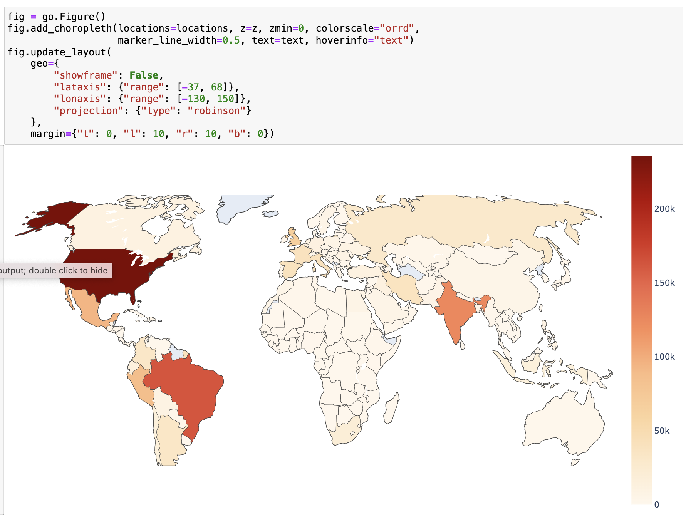

# COVID-19 Time Series Analysis

## Overview:
In this project, I  navigated through the data cleaning and transformation process to ensure the accuracy and reliability of the dataset. I also applied data smoothing techniques to improve clarity.

A crucial aspect of this project revolved around implementing logistic growth modeling, which played a vital role in accurately forecasting emerging trends and potential new waves within the dataset. 

I used Plotly to create insightful and interactive graphs. These visualizations helped convey precise and insightful representations of the analyzed data. Ultimately, these visualizations yielded outputs that effectively communicated underlying patterns and trends.

This project has 7 sections: 

##### 01 Getting_the_Data
##### 02 Data_Cleaning_and_Transformation
##### 03 Data_Smoothing
##### 04 Exponential_Growth_and_Decline_Models
##### 05 Logistic_Growth_Models
##### 06 Modeling_New_Waves
##### 07 Visualizations_with_Plotly

## Accessibility
To ensure that the contents of this repository are accessible and convenient for everyone, I provide two formats for the project materials:
#### PDF Versions:
These PDFs offer an easy way to view the project's content without additional software, making it more accessible on various devices or for printing.
#### Jupyter Notebooks:
These notebooks allow you to run the code, modify analyses, and explore the datasets firsthand. Downloading the Jupyter Notebooks locally provides a dynamic and engaging way to engage with the methodologies and conclusions I've drawn in this project.

## Data Sources:
[Johns Hopkins COVID-19 GitHub repository](https://github.com/CSSEGISandData/COVID-19)

## Vizualizations:
#### California Cases Predictions:

#### California Cases and Deaths:

#### Global Choropleth:

### References:
Skill Share Project: Build an Interactive Data Analytics Dashboard with Python Taught by Ted Petrou.

