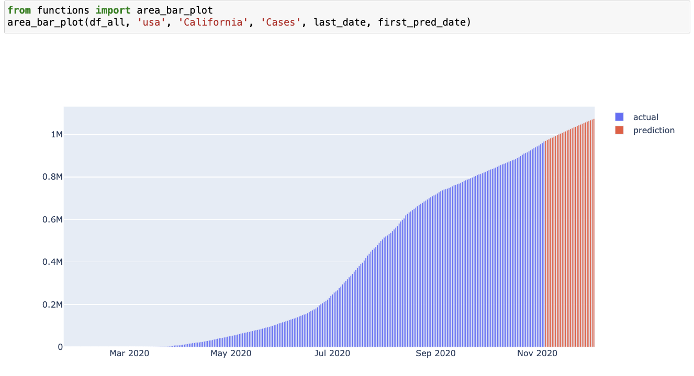
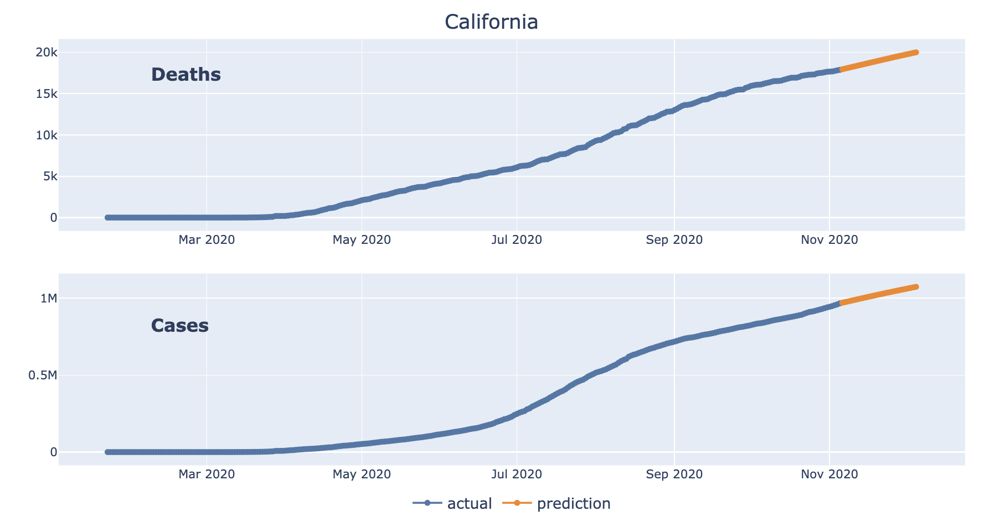
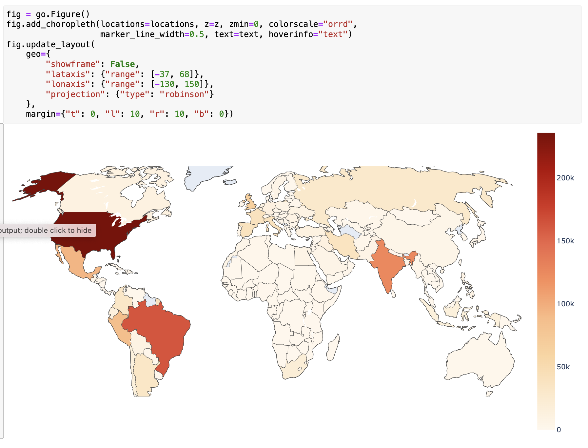

# COVID Trend Projections

## Overview:
In this project, I  navigated through the data cleaning and transformation process to ensure the accuracy and reliability of the dataset. I also applied data smoothing techniques to improve clarity.

A crucial aspect of this project revolved around implementing logistic growth modeling, which played a vital role in accurately forecasting emerging trends and potential new waves within the dataset. 

I used Plotly to create insightful and interactive graphs. These visualizations helped convey precise and insightful representations of the analyzed data. Ultimately, these visualizations yielded outputs that effectively communicated underlying patterns and trends.

This project has 7 sections: 

##### 01 Getting_the_Data
##### 02 Data_Cleaning_and_Transformation
##### 03 Data_Smoothing
##### 04 Exponential_Growth_and_Decline_Models
##### 05 Logistic_Growth_Models
##### 06 Modeling_New_Waves
##### 07 Visualizations_with_Plotly

## Data Sources:
[Johns Hopkins COVID-19 GitHub repository](https://github.com/CSSEGISandData/COVID-19)

## Vizualizations:

### References:
Skill Share Project: Build an Interactive Data Analytics Dashboard with Python Taught by Ted Petrou.

