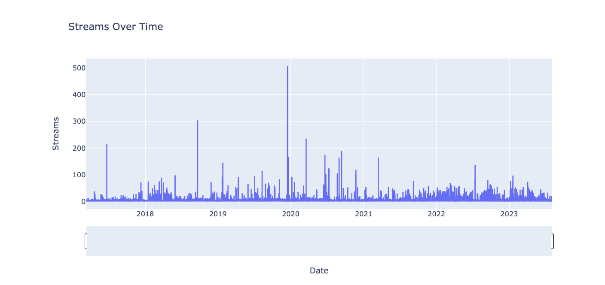
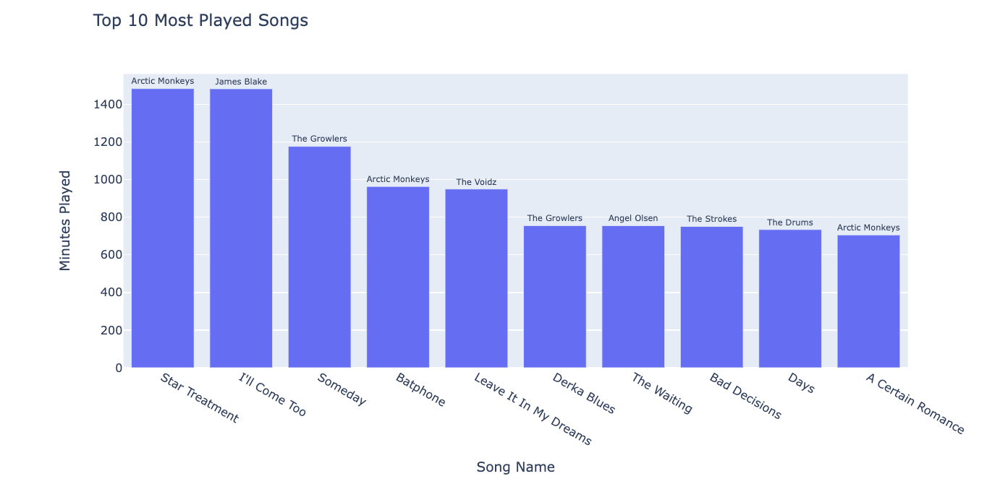
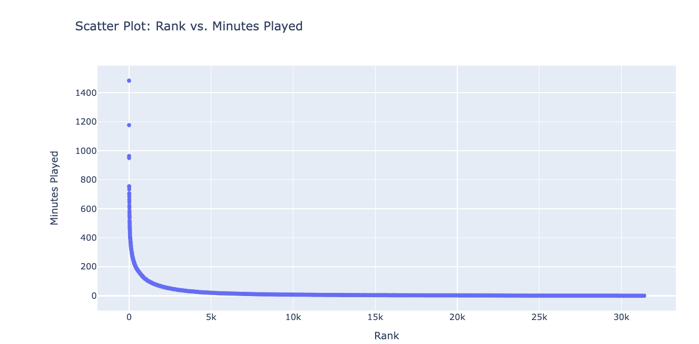
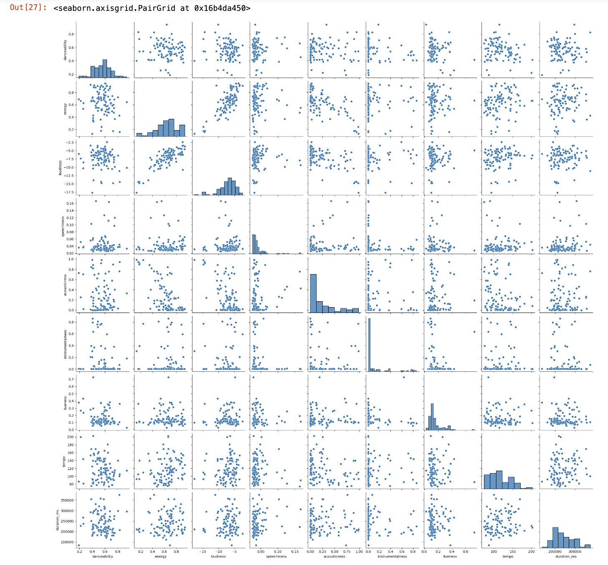

# Spotify Streaming History EDA

## Overview:

After obtaining my streaming history from Spotify, I explored my musical preferences and listening patterns. The initial step involved a thorough examination of my personal streaming history to uncover insights into my listening habits. 

To enrich this analysis, I used Spotify's API, which offered additional information about the tracks in my streaming history.
Using the Spotify API, I was able to access detailed attributes of each track, such as "energy," "tempo," "instrumentalness," and several other musical features. This allowed me to quantify the characteristics of the music I listened to and provided a more solid understanding of what draws me to certain songs or genres.

I employed various data cleaning and aggregation techniques in this project to organize and sift through the data effectively. To summarize my findings, I created insightful graphs that visualize my analysis. These visuals underlined trends and patterns in my streaming history.

## Enhanced Accessibility: PDF Version of the Project:
I have included a  PDF version of my project to enhance the reading experience and accommodate the practical limitations of sharing my project.

 Given the substantial size of my streaming data and sensitive information, such as IP addresses and usernames, finding a solution that allows me to share my findings safely and practically was crucial.

Showcasing this project as a PDF effectively avoids the challenges of directly uploading large datasets and managing sensitive personal information. This PDF document is an exported copy of my Jupyter Notebook, where I meticulously developed my analysis. The original Jupyter Notebook file can be found in this repository. 

## Vizualizations:

### References:
https://www.spotify.com/

